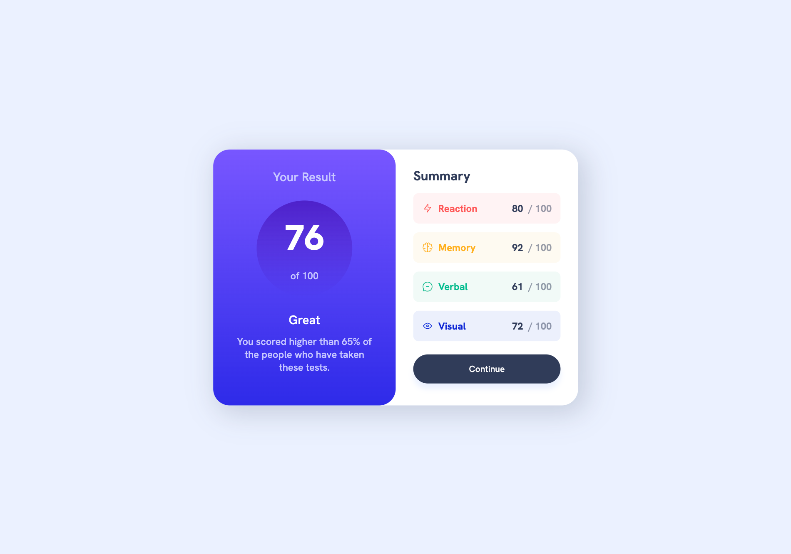

# Frontend Mentor - Results summary component solution

This is a solution to the [Results summary component challenge on Frontend Mentor](https://www.frontendmentor.io/challenges/results-summary-component-CE_K6s0maV). Frontend Mentor challenges help you improve your coding skills by building realistic projects. 

## Table of contents

- [Overview](#overview)
  - [The challenge](#the-challenge)
  - [Screenshot](#screenshot)
  - [Links](#links)
- [My process](#my-process)
  - [Built with](#built-with)
  - [What I learned](#what-i-learned)
  - [Continued development](#continued-development)

## Overview

### The challenge

Users should be able to:

- View the optimal layout for the interface depending on their device's screen size
- See hover and focus states for all interactive elements on the page
- **Bonus**: Use the local JSON data to dynamically populate the content

### Screenshot





### Links

- Solution URL: [GitHub](https://github.com/Ayako-Yokoe/results-summary-component-main)
- Live Site URL: [Vercel](https://results-summary-component-main-sable-ten.vercel.app/)

## My process

### Built with

- Semantic HTML5 markup
- CSS custom properties
- Flexbox
- CSS Grid
- Mobile-first workflow
- [React](https://reactjs.org/) - JS library

### What I learned

As the instructions stated, I coded this project using a component-based approach. I found it very concise and easy to manage. For the repetitive results, which have different colors and background colors, an array can be used for a simpler solution.

To see how you can add code snippets, see below:

```html
function App() {
  return (
    <div className='wrapper'>
      <div className='container'>
        <Result />
        <div className='summary-wrapper'>
          <Summary />
          <Button />
        </div>
      </div>
    </div>
  )
}
```

### Continued development

I found that using grid is very effective. However, I still need to get the hang of minmax() and clamp() to create an effective responsive design.
# results-summary-component-main
